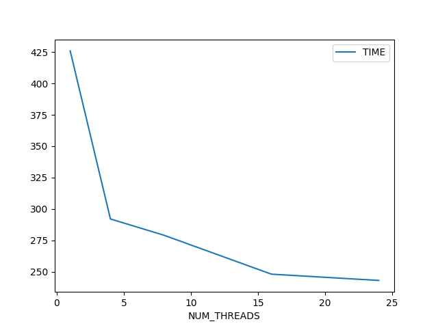
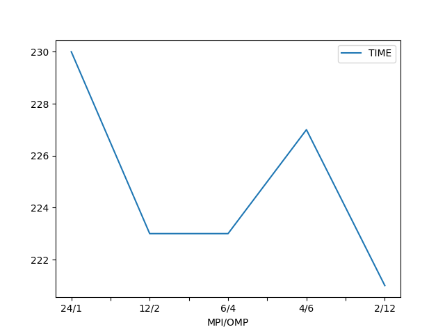

# TDACC (Trade Dangerous Accelerator)

## Introduction
Elite Dangerous is an online multiplayer space video game where commanders (players) pilot space ships around a digital recreation of the Milky Way galaxy. One of the activities players can perform in this game earn in-game currency is trading, which is outlined below.

### Trading
The idea of trading in Elite is fairly simple: buy commodities in one system for a low price and transport and sell them in another solar system to make a profit. Naturally, Traders want to maximize their profit. As a result, tools that compute optimal trading routes with market data and various ship and location parameters as an input have been created.

### Current solutions
The two main accepted tools are
* [inara.cz](https://inara.cz/elite/market-traderoutes/)
* [Trade Dangerous](https://github.com/eyeonus/Trade-Dangerous)

These two tools are distinct in their approach. Inara.cz provides *globally* optimal trade routes that it precomputes every so often without much regard for the exact location of the player. On the other hand, Trade Dangerous computes the optimal trade route from the user's starting point. Since Inara's tooling is closed-source (the website simply displays results), from here we shift our focus to Trade Dangerous.

### Motivation
The current problem with Trade Dangerous is that it is incredibly slow (see statistics in following sections). Without a deep dive into the source code, it seems the performance problems can be attributed to the fact the tool is written in python and runs on a single core. From [previous attempts](https://github.com/eyeonus/Trade-Dangerous/pull/197), spreading work across multiple processes/threads is somewhat beneficial. Thus, in this project, I have created a proof of concept that uses industry-standard parallelization techniques and to elicit performance gains.

## Methods
### Algorithm
A Trade route is split into hops and jumps. A jump is a single traversal between systems. A hop is consisted of multiple jumps where commodities are purchased at the beginning of the hop and sold at the end. Another degree of complexity to this problem is that there are generally multiple stations per system where commodities can be bought and sold. Thus, our algorithm must select the most optimal starting and ending stations for each hop.

When researching this algorithm, I naively assumed that it was NP-Complete as the source code for Trade Dangerous [remarks](https://github.com/eyeonus/Trade-Dangerous/blob/7748478e4a19cfff9973b9c6c23b159167e2c1d6/tradedangerous/tradecalc.py#L657) that the algorithm used is *knapsack-like*. However, after discussing possible solutions to the trading route problem with professor [Abrahim Ladha](https://ladha.me/) (theoretical math/CS lecturer at Georgia Tech), it became evident that this problem could be solved with BFS.

More specifically, a graph of all systems are created where vertices represent systems and edges represent the fact that you can jump between the vertices (systems) of the edge. For each hop, a list of source vertices are provided (the first jump only has one). For each source vertex, all possible destination vertices in the hop are found through breadth first search (whose depth is constrained by a user-defined jumps/hop ratio). Then, for every station in the destination vertices, the maximum profit obtainable by hopping from a station in the source system/vertex to the destination station is recorded. This maximum solution is also max'd with the current global maximum solution for the corresponding destination system. Thus, after all traversals are complete, we are left with a list of stations and the maximum possible profit obtainable with that station as the destination. Furthermore, all visited systems (including this hop and previous hops) are passed to the next hop as source stations.

### Data
Market data is present in the form of a sqlite3 database (`TradeDangerous.db`) and can be downloaded via the Trade Dangerous [eddblink plugin](https://github.com/eyeonus/Trade-Dangerous/wiki/Plugin-Options#eddblink). For the sake of uniformity, the database used in testing and benchmarking is present on the repo.

### Parallelization
Computation of optimal solutions from a source system does not depend on the results of other traversals. Thus, parallelization is trivially achievable by splitting source systems among parallel executors (threads/processes). Node-level parallelization is achieved with OpenMP while internode parallelization is performed with MPI. Results must be combined into a global solution set, which is a serial operation. With OpenMP, results from multiple threads are combined *during* computation via locking solution entries and performing the max operation. On the other hand, the MPI solution adopts a combine step where solutions from non-root ranks are sent to the root rank which synchronously combines the process-level solutions into the global solution set.

### Load Balancing
In the initial OpenMP portion of the code, systems were naively distributed between threads via OpenMP's parallel for with static scheduling. The problem here is that source systems were unevenly distributed in the set of all systems, thus leading to imbalance in load distribution over cores where some cores received many non-source systems and were thus able to skip over much of the work and complete early while other cores had more than a proportional share of the work to complete. A bandaid fix for this was applied with the `schedule(dynamic)` flag for OpenMP's parallel for, allowing for what is essentially **task-parallelism** where work is actively distributed between cores (presumably with a task queue). On my desktop, with 10 jumps, 20 ly per jump, and 2 hops running on 16 cores, the static scheduling version ran in 6:06 (mins:secs) while the dynamic scheduling version ran in 2:45. Furthermore, core utilization was evidently higher. A more elegant solution, however, is to precompute the optimal distribution of systems among cores, which is implemented in the MPI load balancing code. Of course, given more time, I would do the same for the OpenMP code and see if any speedup occurs as a result of the lack of dynamic scheduling overhead.

In addition to task-parallelism, the algorithm I developed is also somewhat data-parallel. While data-parallel is generally a machine learning concept, its relevance to my project becomes evident when you consider the algorithm as the "model". In my algorithm, the data (analogous to the training set in ML), is split across processors, results are computed independently, and crucially results are all sent back to a single source to be collated (instead of average gradients, I perform a maximum). Then, the current state of the program (source systems, previous solutions) is bcasted out to all the workers from the root. The benefit of this method, rather than parallelizing the traversals themselves, is that synchronization/communication only needs to occur at the end of computation, rather than during it.

### Memory Usage
In general, there is a memory/performance tradeoff with many HPC algorithms. This program is no exception. The approach that I take in this program is to allocate more for faster access. This means that I load the entirety of the system market data into ram and also distribute it across MPI ranks in order to minimize the need for communication between ranks. Furthermore, one solution per station per hop per rank is allocated in order to ensure constant time access to solutions. On the other hand, I have taken some steps to reduce RAM usage. For example, I created a custom bitset class to implement the visited set structure for the BFS traversals in my algorithm. Packing booleans into bit vectors generally lowers memory usage by a factor of 32 or 64 (since you can cram 32 or 64 booleans into a single int32/64)

## Running
```
./build/tdacc
```
shows a help message

### Compilation
Note that all tests performed were using the intel icx compler and intel mpi libraries present on ICE.

### Verification
Verification can be performed by running the run.sbatch script and then performing the following
```
cat tdacc-run-2549823.log | grep -A 1 "hop 2" | grep optimal | uniq
```
where you replace the tdacc-run-...log file with the log file from your run. From this, two distinct results should be observed as there are two distinct parameter sets. If there are more, this means that threading has yielded incorrect results.

In terms of global verification, this can be done with the reference implementatio, the trade dangerous script, project linked above.

## Results

### OpenMP Threads vs Time (Seconds)

The above is a plot for the data present in [tdacc-run.csv](tdacc-run.csv), generated with the script [run.sbatch](run.sbatch) where the parameters are 10 jumps, 10 ly per jump, and 2 hops. Note that the first srun in the script is used for a different section. In terms of scaling, we can see that the performance increase from 1 thread to 4 is drastic, yielding a speedup of over 100 seconds. However, the jump from 4 to 8 threads and 8 to 16 threads yields speedups in the magnitude of 10s of seconds. Following a decreasing trend, the jump from 16 to 24 threads is only a 5 second speedup.

Unfortunately, I did not solely time the serial portions of the program. Thus, the times shown in the graph include loading data and the initial traversal. Empirically, this takes about 30s uniformly. Thus, we can calculate our strong scaling speedups

|NUM_THREADS|TIME|SPEEDUP|
|1|396|1|
|4|262|1.5|
|8|249|1.6|
|16|218|1.8|
|24|213|1.85|

As is evident by the above *actual* speedups, increasing thread count does not yield ideal results (I.E, 4 threads would lead to a speedup of 4). Furthermore, as is evident from the above graph and table, increasing thread count has diminishing returns, with initial increases yielding larger speedups and subsequent ones tapering off in benefit. This could be a result of a number of factors (in order of likelihood).
1. The more threads present, the more contention there is for writing solutions (in the OpenMP implementation, at least)
2. Once the work is split up into small enough groups, thread creation and management overhead becomes a problem
3. Larger thread counts lead to lower individual core clock speeds and OS threads have to fight for priority as well.

### MPI Ranks/OMP Threads vs Time (Seconds)


The above is a graph of time to completion (same conditions as the previous graph) with varying MPI/OpenMP ranks/threads. Since the variation between time to completion is in the order of a few seconds out of hundreds overall, we can conclude that there isn't, at least on single node runs, much of a performance loss/gain from varying the amount of OpenMP and MPI threads/ranks.

### Improvement over existing solutions
While thread-to-thread scaling might not be as ideal as I had hoped, the performance gain over Trade Dangerous is impressive. For example, running Trade Dangerous with 20 ly per jump, 10 jumps, and 2 hops completed in 8 hours and 47 minutes on my desktop. The same run on my desktop completed in 2 minutes and 45 seconds. This is about a 190x speedup. On ICE, running on the 24 core intel nodes, this takes 9 minutes and 10 seconds.

## Conclusion

The goal of this project was to create a faster Elite Dangerous trade-route finder that utilizes all the available resources on a system to extract as much performance as possible. Compared to the existing solution, Trade Dangerous, this goal was vastly exceeded. However, scaling on systems with large but weaker cores, such as the ICE cluster, leaves some room for improvement. In the future, a more detailed performance analysis of TDACC can be performed in order to figure out where the bottleneck is: thread overhead, communication, or the computation itself.
